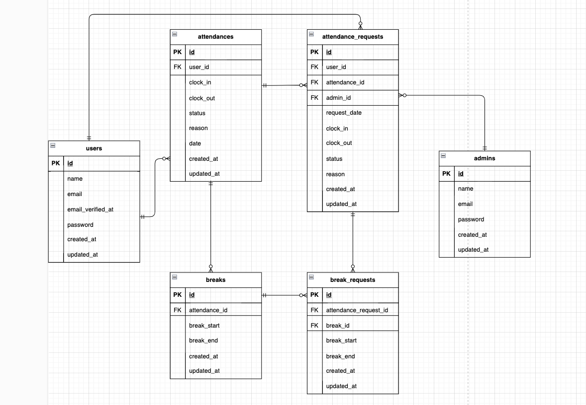

# COACHTECH 勤怠管理アプリ

## 環境構築

### Dockerビルド手順
1. `git clone git@github.com:mabe4242/Attendance-Manegement-App.git`
2. `docker-compose up -d --build`

※ MySQLは、OSによって起動しない場合があるので、それぞれのPCに合わせて `docker-compose.yml` ファイルを編集してください。

### Laravel環境構築手順
1. `docker-compose exec php bash`
2. `composer install`
3. `.env.example` ファイルから `.env` を作成し、環境変数を編集
4. `.env.testing.example` ファイルから `.env.testing` を作成し、環境変数を編集
5. `php artisan key:generate`
6. `php artisan migrate`
7. `php artisan migrate --env=testing`
8. `php artisan db:seed`
9. `exit`でPHPコンテナを抜けて、ターミナルで`mailhog`と入力し、Mailhogが立ち上がっていることをご確認ください。

## 使用技術（実行環境）
- PHP 8.1.33
- JavaScript (ES6+)
- Laravel 8.83.8
- MySQL 8.0.26

## ER図
  

## メール認証につきまして
このプロジェクトでは Mailhog を利用してメール送信の確認を行います。  
docker-compose.yml に Mailhog コンテナを含めているため、以下のURLでメールを確認できます。
[http://localhost:8025](http://localhost:8025)

ユーザー登録をすると確認メールが送信されます。
メール認証誘導画面からMailhogのメール認証画面にアクセスして、認証してください。
認証メールの再送を行なった場合もこちらの画面からメールのご確認をお願いいたします。
URL: http://localhost:8025

## テスト時のデータベースにつきまして
本番用DBとテスト用のDBを切り替えております。
テスト実行の際は上記の環境構築後に、`php artisan test`でテストの実行をご確認ください。

## ダミーデータにつきまして

## URL
- 開発環境： [http://localhost/](http://localhost/)
- phpMyAdmin： [http://localhost:8080/](http://localhost:8080/)
- 一般ユーザーログイン画面： [http://localhost/login](http://localhost/login)
- 管理者ログイン画面： [http://localhost/admin/login](http://localhost/admin/login)